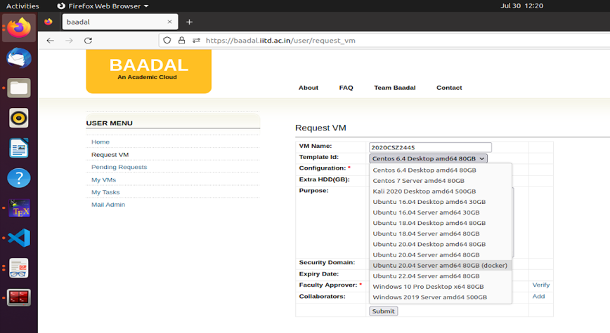
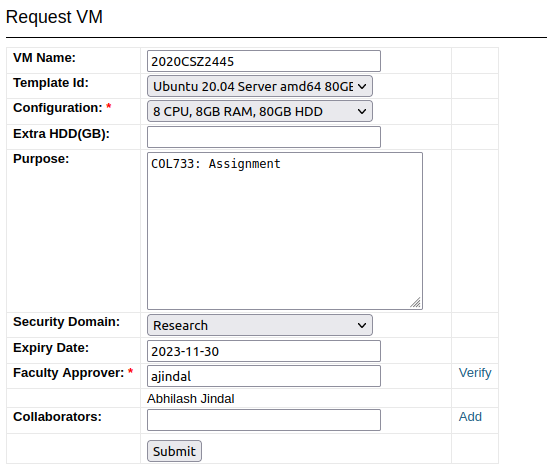

# COL733: Fundamentals of Cloud Computing

### Semester I, 2024-2025

### Lab-1: Fault tolerant word count

### 6 August 2024

# Submission Instructions

1. You can **only** use Python, Pandas and Redis for this Lab. **Use of any other libraries** will lead to zero marks in the Lab.
2. You will submit the source code in **zip** format to [Moodle](https://moodle.iitd.ac.in/mod/assign/view.php?id=121472) (Lab 1). The naming convention of the zip file should be &lt;Entry_Number&gt;\_&lt;First_Name&gt;.zip. Additionally, you will need to submit a **pdf** for analysis questions on Gradescope.
3. The Lab would be **auto-graded**. Therefore, **follow** the same naming conventions described in the Deliverables section. Failing to adhere to these conventions will lead to zero marks in the Lab.
4. You should write the code **without** taking help from your peers or referring to online resources except for documentation. The results reported in the report should be **generated from Baadal-VM**. Not doing any of these will be considered a breach of the honor code, and the consequences would range from zero marks in the Lab to a disciplinary committee action.
5. You can use **Piazza** for any queries related to the Lab.
6. We suggest you **start early** to avoid the last-minute rush.

# Setup Instructions

How to get your Virtual Machine?

- Go to BaadalVM website to request a VM <https://baadal.iitd.ac.in/user/request_vm>
- Use your entry number as the VM name. Choose \`Ubuntu 20.04 Server amd64 80GB (docker)\` in Template ID.



- Choose 8 CPU, 8GB RAM, 80GB HDD in configuration and 30 November 2024 as the VM expiry date. Add \`ajindal\` as faculty approver and submit.



- Once the VM is created, you will be able to check the VM’s Private IP by clicking \`My VMs\`.


### Using your Virtual Machine

- If you’re outside the IITD campus, you will first need to get VPN access. See here: [VPN instructions](https://web.iitd.ac.in/~csz198763/COL100_lab_assignment/vpn/COL100_VPN.pdf).
- After verifying that you’re able to ssh into a CSC machine and after receiving your VM IP. You may receive an email with a default username (baadalvm) and password (baadal) during VM creation.
```bash
$ ssh baadalvm@<YOUR_PRIVATE_IP>
```

- You can change your password after your first login by running:
```bash
$ passwd baadalvm
```

**Note: Remember to note this password. If you forget your password, there may not be any way to recover it.**

### Redis Installation:

- Execute the following commands to install redis on your VM using docker.
```bash
$ sudo apt install redis-tools
$ mkdir /home/baadalvm/redis
$ docker run -d -p 6379:6379 -v /home/baadalvm/redis:/data --name redis --rm redis:7.4

```

- Use the following commands to verify the successful installation of Redis.

```bash
$ redis-cli --version
$ redis-cli ping
```

# Dataset Description

The dataset is available at [link](https://www.kaggle.com/thoughtvector/customer-support-on-twitter) [1]. Each CSV file contains 7 attributes, following are a brief description of each attribute:

- **_tweet_id:_** A unique, anonymized ID for the Tweet. Referenced by response_tweet_id and in_response_to_tweet_id.
- **_author_id:_** A unique, anonymized user ID. [@s](https://www.kaggle.com/s) in the dataset have been replaced with their associated anonymized user ID.
- **_inbound:_** Whether the tweet is "inbound" to a company doing customer support on Twitter. This feature is useful when re-organizing data for training conversational models.
- **_created_at:_** Date and time when the tweet was sent.
- **_text:_** Tweet content. Sensitive information like phone numbers and email addresses are replaced with mask values like \__email_\_.
- **_response_tweet_id:_** IDs of tweets that are responses to this tweet, comma separated.
- **_in_response_to_tweet_id:_** ID of the tweet this tweet is in response to, if any.

# Problem Statement

**Count the occurrence of each word given a set of files**. Your task is to create an application that can handle the large amount of data, which is estimated to be in the range of GBs.

- Since a serial word count will not be sufficient, you need to design a scalable word count application that can handle the size of the dataset.
- Since there is a possibility of faults in the system, you need to make your implementation tolerant to worker faults (failures) as well as redis-server faults.

### Logistics:

- You are provided with the starter code for the challenge.
- Please use python version 3.10 and Redis version 7.4.
- A serial version of the word count code is provided as `serial.py` for your reference. You can use this to evaluate the correctness of your parallel implementation. Note that you just need to split the text by the space delimiter to get the words.
- The test cases will consist of multiple (>8) CSV files each of size ~3.5MB. You can use the provided `split_csv.py` to split the dataset into multiple small csv files.
- Do NOT use any password for your Redis instance and ensure that _password=None_ is not changed in mrds.py file.
- You can use the docker commands to restart redis. `docker stop redis`, `docker restart redis`.

### Deliverables

#### **_Source code_**: 
You need to provide the source code for the word counting application implemented using the python **_multiprocessing_** library. The source code should be in a .zip format and should be uploaded to Moodle. A sample source code folder structure is shown below:
```
directory: 2020CSZ2445_Abhisek
            2020CSZ2445_Abhisek/client.py
            2020CSZ2445_Abhisek/base.py
            2020CSZ2445_Abhisek/config.json
            2020CSZ2445_Abhisek/config.py
            2020CSZ2445_Abhisek/mrds.py
            2020CSZ2445_Abhisek/worker.py
            2020CSZ2445_Abhisek/__init__.py
            2020CSZ2445_Abhisek/mylib.lua
            2020CSZ2445_Abhisek/requirements.txt
```

When we unzip the submission then we should see the above files in the aforementioned structure.

- Your word-count application should be named **_client.py_** and runnable by the following command. _Note:_ All the relevant information necessary for the word count application is available in **_config.json_**
```bash
python3 client.py
```

- **_We will change the client.py and config.json files with appropriate values during evaluation. Therefore, do not change these files._**
- **_The evaluation script will load the redis function. You need not write any code to load it. The evaluation script will use the command below to load the redis function from mylib.lua._**

```bash
cat mylib.lua | redis-cli -x FUNCTION LOAD REPLACE
```

#### **_Analysis:_** 
Answer the following questions on Gradescope (Lab 1: Analysis):

1. Given a fixed input size, measure how the efficiency of the word-count application varies with an increase in workers (in the range of \[1, 32\]) allocated to the application. Justify.
2. Given a fixed number of worker processes (= 8) allocated to the application, measure how the efficiency of the word-count application varies with input size. Justify.
3. Describe how your code is tolerant to **worker** failures. In other words, describe why your code is guaranteed to provide the same answer even if a worker crashes.
4. Describe how your code is tolerant to **Redis** failures. In other words, describe why your code is guaranteed to provide the same answer even if Redis crashes.

# Rubrics (40 marks)

1. **2 marks:** Correctness of word-count application with single worker process.
2. **5 marks:** Correctness of word-count application with multiple worker processes.
3. **5 marks:** The word-count application is _worker_ fault-tolerant.
4. **5 marks:** The word-count application is _Redis_ fault-tolerant.
5. **8 marks:** This has relative grading. The faster programs on multiple workers will receive higher marks.
6. **15 marks:** Justifications and analysis as requested in the deliverables.

# References

\[1\]: <https://www.kaggle.com/thoughtvector/customer-support-on-twitter>

